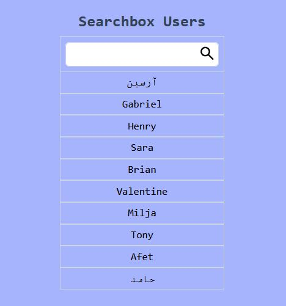

# Searchbox Component!

## Objetivos:

Construir un componente con funcionalidad de búsqueda para que cuando se tipee dentro del input la lista de usuarios sea filtrada.

1.  Si no hay coincidencia con ningun usuario se deberá mostrar el mensaje _**"No matches"**_

2.  Al ingresar el primer caracter dentro del input, el ícono de lupa debe cambiar por el de una X.

3.  Al clickear en la X se deberá borrar el texto del input y volver al estado inicial (mostrando los usuarios de la lista, el input vacío y el icono de lupa).

## Recursos:

- [API de usuarios random](https://randomuser.me/api/?results=100)

---

## Deploy

[Visitar Web](https://searchbox-users-component.vercel.app/)

